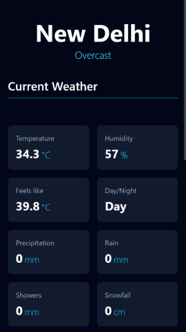

[](https://weather.axwaizee.xyz/)

<div align="center">

A modern, responsive, and installable weather forecast application built with React and Vite. This project provides real-time current and hourly weather data based on the user's geolocation. [View Live Demo](https://weather.axwaizee.xyz/)

---

[](https://opensource.org/licenses/MIT)
[](https://react.dev/)
[](https://vitejs.dev/)
[](https://tailwindcss.com/)

</div>


## Preview

<div align="center">

[](https://weather.axwaizee.xyz/)

</div>

## About The Project

This project is a complete, modern web application that provides a clean and intuitive interface for checking local weather. It started as a simple HTML, CSS, and JS project and was migrated to a powerful tech stack to create a feature-rich, high-performance Progressive Web App (PWA).

The app automatically detects the user's location and delivers up-to-date weather information, including an interactive hourly forecast chart. It is fully optimized and can be installed on any device like a native app.

## Features

- **Geolocation**: Automatically fetches weather data for the user's current location.
- **Real-time Data**: Displays current conditions like temperature, humidity, wind speed, and "feels like" temperature.
- **Interactive Hourly Forecast**: A draggable, snap-scrolling hourly forecast complete with an animated temperature trend chart.
- **Dynamic Loading Screen**: An engaging loading screen with animated, randomized weather facts and tips.
- **Progressive Web App (PWA)**: Fully installable on mobile and desktop devices for an app-like experience.
- **Modern Animations**: Smooth, professional animations powered by GSAP.
- **SEO Optimized**: Dynamic meta tags, structured data (JSON-LD), and a sitemap for high visibility on search engines.

## Tech Stack

This project was built using the following technologies:

- **Frontend:** [React.js](https://react.dev/) (v19)
- **Build Tool:** [Vite](https://vitejs.dev/)
- **Styling:** [Tailwind CSS](https://tailwindcss.com/)
- **Animations:** [GSAP (GreenSock Animation Platform)](https://gsap.com/)
- **Charting:** [Recharts](https://recharts.org/)
- **PWA:** [Vite PWA Plugin](https://vite-pwa-org.netlify.app/)
- **Deployment:** [GitHub Pages](https://pages.github.com/)

## Getting Started

To get a local copy up and running, follow these simple steps.

### Prerequisites

- Node.js (v20 or higher)
- npm

### Installation

1. Clone the repo:
    ```sh
    git clone https://github.com/Axwaizee/Weather.git
    ```
1. Navigate to the project directory:
    ```sh
    cd Weather
    ```
1. Install NPM packages:
    ```sh
    npm install
    ```
1. Run the development server:
    ```sh
    npm run dev
    ```
The app will be available at `http://localhost:5173`.

> [!IMPORTANT]
> **Secure Context Required for Geolocation**
> Modern browsers require a secure context (**HTTPS**) to use the Geolocation API. The location feature will work on `localhost` during development, but your deployed site **must** be served over `https` for it to function. Fortunately, GitHub Pages automatically provides a free SSL certificate.

## Acknowledgments

This project relies on free and open-source APIs. A huge thank you to:

- [Open-Meteo](https://open-meteo.com/) for providing the comprehensive weather forecast data.
- [Nominatim (OpenStreetMap)](https://nominatim.org/) for the fast and reliable reverse geocoding service.

## License

This project is licensed under the MIT License. See the [LICENSE](./LICENSE) file for details.
